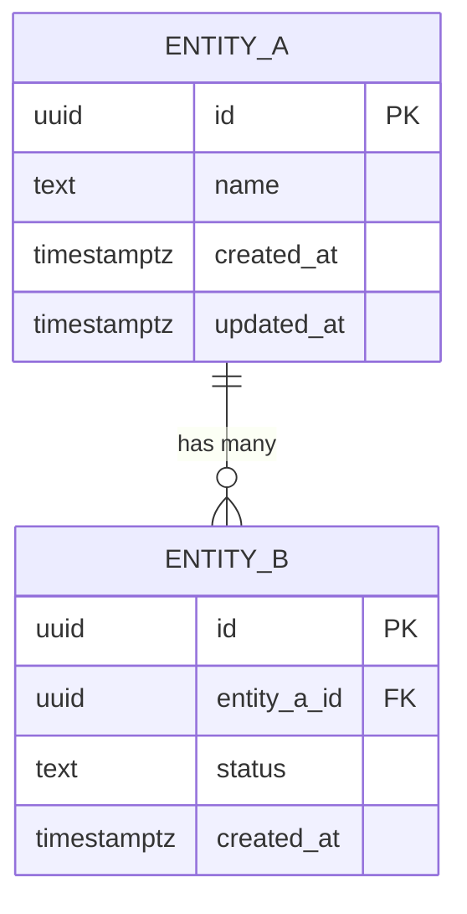

# Data Model Template — AI SDLC Factory

---

# Data Model — [Project Name]

**Versión**: v1
**Fecha**: [YYYY-MM-DD]
**PRD Reference**: `docs/product/prd-vN.md`
**ADR Reference**: `docs/architecture/adr/ADR-002-*.md`

---

## 1. ER Diagram



---

## 2. Table Definitions

### `entity_a`

| Column | Type | Constraints | Default | Description |
|:---|:---|:---|:---|:---|
| `id` | `UUID` | PK, NOT NULL | `gen_random_uuid()` | _Unique identifier_ |
| `name` | `TEXT` | NOT NULL | - | _[Description]_ |
| `created_at` | `TIMESTAMPTZ` | NOT NULL | `now()` | _Creation timestamp_ |
| `updated_at` | `TIMESTAMPTZ` | NOT NULL | `now()` | _Last update timestamp_ |

### `entity_b`

| Column | Type | Constraints | Default | Description |
|:---|:---|:---|:---|:---|
| `id` | `UUID` | PK, NOT NULL | `gen_random_uuid()` | _Unique identifier_ |
| `entity_a_id` | `UUID` | FK → entity_a.id, NOT NULL | - | _Foreign key reference_ |
| `status` | `TEXT` | NOT NULL | `'pending'` | _[Description]_ |
| `created_at` | `TIMESTAMPTZ` | NOT NULL | `now()` | _Creation timestamp_ |

---

## 3. Indexes

| Table | Index Name | Columns | Type | Reason |
|:---|:---|:---|:---|:---|
| `entity_b` | `idx_entity_b_entity_a_id` | `entity_a_id` | B-tree | FK lookup performance |
| `entity_b` | `idx_entity_b_status` | `status` | B-tree | Filter by status |

---

## 4. Row Level Security (RLS)

### `entity_a`

```sql
ALTER TABLE entity_a ENABLE ROW LEVEL SECURITY;

-- SELECT: users can view records in their organization
CREATE POLICY "select_own_org" ON entity_a
    FOR SELECT USING (
        organization_id IN (
            SELECT organization_id FROM user_organizations
            WHERE user_id = auth.uid()
        )
    );

-- INSERT: users can create records in their organization
CREATE POLICY "insert_own_org" ON entity_a
    FOR INSERT WITH CHECK (
        organization_id IN (
            SELECT organization_id FROM user_organizations
            WHERE user_id = auth.uid()
        )
    );
```

---

## 5. Enums / Lookup Values

| Enum | Values | Used By |
|:---|:---|:---|
| `status` | `pending`, `active`, `completed`, `cancelled` | `entity_b.status` |

---

## 6. Migration Strategy

| Order | Migration | Description |
|:---|:---|:---|
| 001 | Create base tables | Create `entity_a`, `entity_b` with constraints |
| 002 | Add indexes | Create performance indexes |
| 003 | Enable RLS | Add RLS policies for multitenancy |
| 004 | Seed data | Insert initial lookup/seed data |

---

## 7. Notes

- _[Considerations about data volume, partitioning, archival strategy]_
- _[Notes about data sensitivity and encryption needs]_
